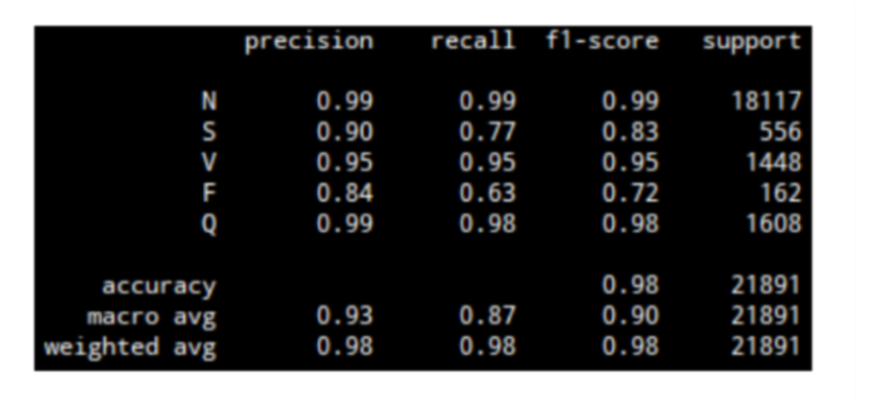

In this project, continuous wavelet transform and convolutional neural networks are used to classify EKG signals into 5 classes of arrhythmia.

The dataset used in this project is the MIT-BIH Arrhythmia Dataset.

**load_data.py**: Loads the train and test data from the dataset, saving them each to train_data and test_data, Contains functions that return the train and test labels

**cnn.py**: Contains functions that can apply continuous wavelet transform on datasets and return the resulting 3D coefficients array, Contains a function that defines the CNN model, Saves the 3D coefficients array obtained from train_data and test_data as train_images and test_images

**train_cnn.py**: Uses the functions and data from cnn.py and load_data.py to train and save the CNN model.

**test_cnn.py**: Uses the saved model from train_cnn.py and the test labels from load_data.py to predict and classify test_images from cnn.py, Contains a function that plots a confusion matrix which gives a visual representation of the model's performance on test_images.

The following confusion matrix and table show the outcome of the project:

